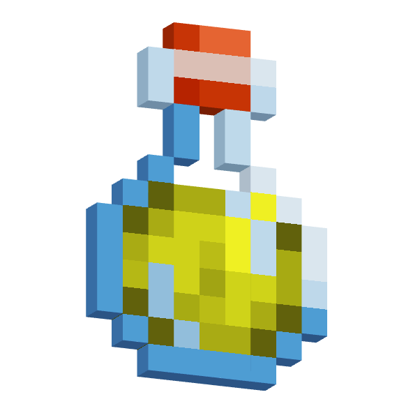
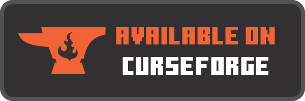

  

    <b>Vanilla Friendly X-Ray: See Ores Through Walls!</b>

    
    

    
    &nbsp;&nbsp;
    
    &nbsp;&nbsp;
    

 

 

 

 

<h3>
 <strong>
X-Ray Potion Effect
 </strong>
</h3>

The Potion of Spelunking grants you a potion effect that allows you to see ores through walls!

 

<h3>
 <strong>
Potion of Spelunking II
 </strong>
</h3>

Has a greater range than its lesser counterpart, but it lasts less time and is rarer. More commonly found in Buried Treasure and End City chests.

 

<h3>
 <strong>
Only Found as Loot
 </strong>
</h3>

To balance this effect, you can only find them in chests. They are more commonly found in Mineshaft Minecart chests, but can also be found in Buried Treasure and End City chests.

 

<h3>
 <strong>
Currently Implemented Ores and Blocks:
 </strong>
</h3>

<ul>
 <li>Coal Ore</li>
 <li>Deepslate Coal Ore</li>
 <li>Copper Ore</li>
 <li>Deepslate Copper Ore</li>
 <li>Iron Ore</li>
 <li>Deepslate Iron Ore</li>
 <li>Gold Ore</li>
 <li>Deepslate Gold Ore</li>
 <li>Redstone Ore</li>
 <li>Deepslate Redstone Ore</li>
 <li>Lapis Lazuli Ore</li>
 <li>Deepslate Lapis Lazuli Ore</li>
 <li>Emerald Ore</li>
 <li>Deepslate Emerald Ore</li>
 <li>Diamond Ore</li>
 <li>Deepslate Diamond ore</li>
 <li>Nether Gold Ore</li>
 <li>Nether Quartz Ore</li>
 <li>Ancient Debris</li>
</ul>

 

 

    
    &nbsp;&nbsp;
    

DanMizu&copy;

